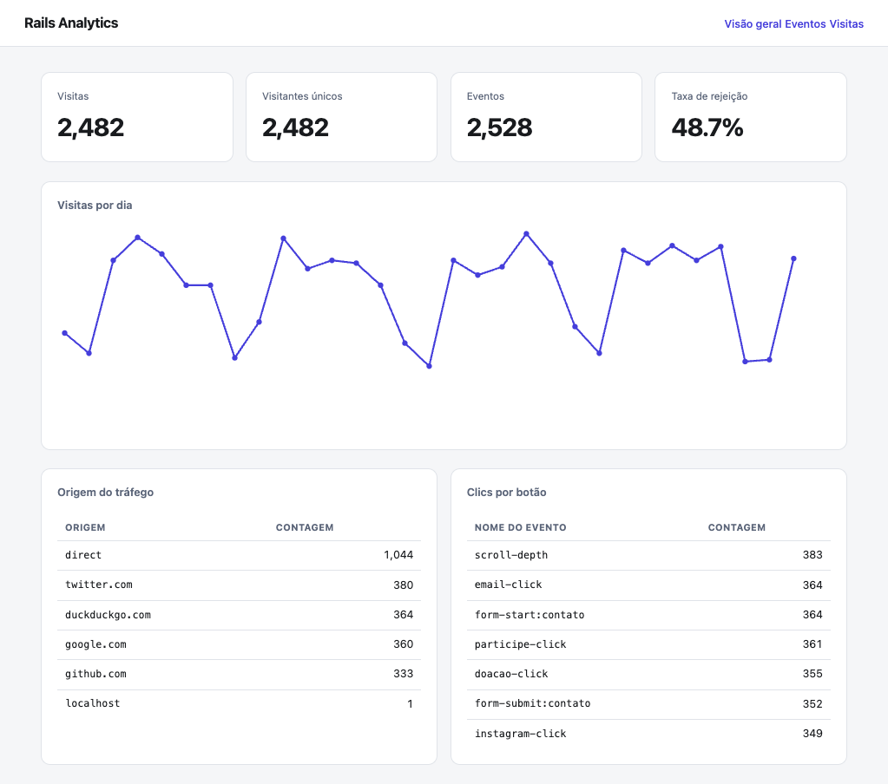
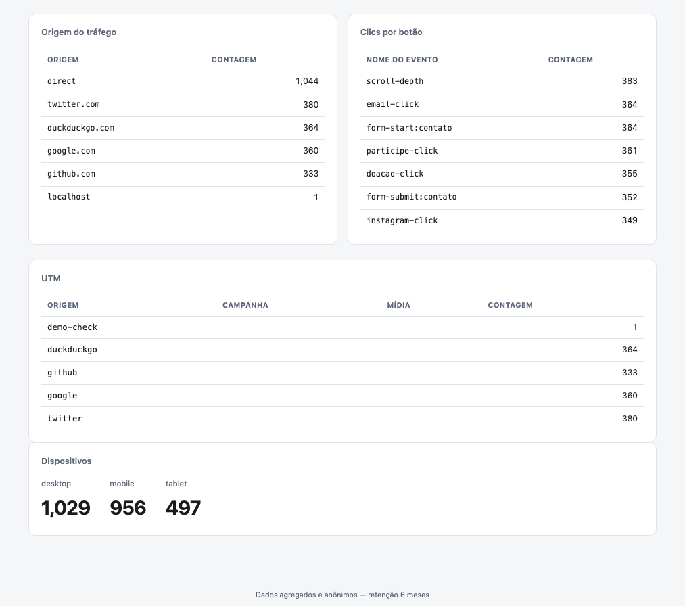

# Rails Analytics

A privacy-first analytics engine for Rails. Cookie-less, LGPD-compliant, and free of
third-party analytics dependencies — it collects traffic **server-side**, stores it in
your own database, and renders an aggregated dashboard with zero client-side JS
dependencies.

## Screenshots

| Dashboard — aggregated overview | Dashboard — events & visits |
|:---:|:---:|
|  |  |

## How it works

```
┌─────────────┐   tracker.js (injetado no layout)
│  Navegador  │──────────────────────────────►  POST /analytics/collect
└─────────────┘                                    │
                                                   ▼
                                        ┌──────────────────────┐
                                        │ AnalyticsController  │  assinado com token,
                                        │  (rails_analytics)   │  IP mascarado antes
                                        └──────────┬───────────┘  de persistir
                                                   ▼
                                        ┌──────────────────────┐
                                        │   rails_analytics_   │  visits + events
                                        │   visits / events    │  (6-month retention)
                                        └──────────┬───────────┘
                                                   ▼
                                        ┌──────────────────────┐
                                        │  Dashboard em        │  overview / events /
                                        │  /analytics         │  visits
                                        └──────────────────────┘
```

1. The **tracker JS** (injected by the generator into your layout `<head>`) collects
   path, referrer domain, viewport, language, and a per-page nonce — no cookies, no
   localStorage.
2. On `load`, the tracker POSTs a **signed token** to the engine's collect endpoint
   using `navigator.sendBeacon` (same-origin, no CORS).
3. The engine verifies the token, **masks the IP** (before anything hits disk),
   derives a **daily anonymity key**, and stores a `Visit` row. Custom events are
   stored as `Event` rows linked to the visit.
4. The **dashboard** in `/rails_analytics` shows aggregated metrics from pure SQL
   queries in three views: overview, events, and visits.

## Requirements

- Ruby >= 3.0
- Rails >= 7.0 (tested on 8.1)
- Database: SQLite, PostgreSQL or MySQL (anything Active Record supports)

## Installation

### 1. Add the gem

```ruby
# Gemfile
gem "rails_analytics"
```

```bash
bundle install
```

### 2. Run the install generator

```bash
bin/rails generate rails_analytics:install
```

The generator does three things:

| Action | File | Detail |
|--------|------|--------|
| Copies the migrations | `db/migrate/xxx_create_rails_analytics_*.rb` | creates the `rails_analytics_daily_salts`, `rails_analytics_visits` and `rails_analytics_events` tables |
| Mounts the engine | `config/routes.rb` | adds `mount RailsAnalytics::Engine => RailsAnalytics.config.mount_path` (default `/analytics`) |
| Injects the tracker | `app/views/layouts/*.html.erb` | adds `<%= rails_analytics_tracker_tag %>` to the `<head>` of the first layout |

### 3. Migrate the database

```bash
bin/rails db:migrate
```

Done — collection is automatic and the dashboard lives at **`/analytics`** (or your configured `mount_path`).

## Mounting

You can mount the engine at any path:

```ruby
# config/routes.rb
mount RailsAnalytics::Engine => "/analytics"
```

```erb
<!-- layout -->
<%= rails_analytics_tracker_tag endpoint: "/analytics" %>
```

> The `endpoint:` passed to the helper must match the path the engine is mounted at.
> You can also set a global default via `RailsAnalytics.configure { |c| c.mount_path = "/analytics" }`.

## Authentication

The dashboard is protected by an auth callback. By default it calls `authenticate_admin!`
on the host app's `ApplicationController` (the engine controller **inherits from the
host** `ApplicationController`, so Devise and friends keep working out of the box).

```ruby
# config/initializers/rails_analytics.rb
RailsAnalytics.configure do |config|
  # Symbol: sent to the host ApplicationController
  config.auth_callback = :authenticate_admin!

  # or a callable:
  config.auth_callback = -> { current_user&.admin? }
end
```

## Compliance

### What is collected

- Path (landing page)
- Referrer domain
- Device type (desktop / mobile / tablet)
- Viewport size
- Browser language
- Timestamp (UTC)
- Per-page nonce (one-time signed token)
- UTM parameters (`utm_source`, `utm_medium`, `utm_campaign`, `utm_term`, `utm_content`)

### What is NEVER collected

- Cookies
- localStorage
- Browser fingerprinting
- Raw IP address
- Full `User-Agent` string
- Any PII (names, emails, form input, clicks)

### Why cookie-less

Brazil's ANPD cookie guide classifies analytics cookies as **"non-essential"**, which
require prior opt-in consent (LGPD). Rails Analytics sidesteps this entirely: it uses no
cookies, no localStorage, and no fingerprinting — so there is nothing to consent to and
no cookie banner needed for analytics.

### IP masking

IPs are masked **before any storage**:

- IPv4: last octet zeroed (`203.0.113.45` → `203.0.113.0`)
- IPv6: last 80 bits zeroed (`2001:db8::/48`)
- IPv4-mapped IPv6 is normalized back to the masked IPv4 form

### Anonymity key

Unique-visitor counting uses an **anonymity key** derived from:

```
SHA256(masked_ip + coarse_ua_bucket + daily_salt)
```

- The "coarse UA bucket" is just `"<browser>:<os>"` (e.g. `Chrome:macOS`) — never the
  full user-agent string.
- A **salt rotates daily**, so a key cannot be correlated across days. A visitor
  returning tomorrow gets a brand-new identity.

### Retention

Data is kept for **6 months** per the Brazilian Civil Rights Framework for the Internet
(Marco Civil, art. 15). A `RetentionJob` purges records older than that; schedule it in
your app, e.g.:

```ruby
# config/schedule.rb (or cron)
# Daily purge of records older than 6 months
```

## Tracker API

The tracker exposes a small global for custom events:

```js
window.RailsAnalytics.track(name, props)
```

Examples:

```js
// Donation click (button click)
document.querySelector("#donate-btn").addEventListener("click", () => {
  window.RailsAnalytics.track("donation-click", { value: 50 });
});

// Scroll depth (once the reader passes 75%)
window.addEventListener("scroll", () => {
  if (window.scrollY / document.body.scrollHeight > 0.75 && !tracked) {
    tracked = true;
    window.RailsAnalytics.track("scroll-depth", { threshold: 75 });
  }
});
```

Events appear in the **events** dashboard view, where they can be filtered by name and
inspected with their properties.

## Add a new metric

Metrics are plain SQL in the `Stats` module — add one method and one line in the view:

```ruby
# lib/rails_analytics/stats.rb
def avg_visits_per_day(since: default_since)
  total_visits(since: since) / 30.0
end
```

```erb
<!-- app/views/rails_analytics/dashboards/overview.html.erb -->
<%= render "metric", label: "Avg visits/day", value: number_with_precision(@stats.avg_visits_per_day, precision: 1) %>
```

## Run the demo

The bundled `test/dummy` app is a full demo: a Brazilian campaign landing page with the
tracker wired up, plus an admin dashboard with seeded aggregate data.

```bash
# from the gem root
cd test/dummy
bin/rails server
```

Then open:

| URL | What you'll see |
|-----|-----------------|
| `http://localhost:3000/` | Campaign landing page — click the donate / social buttons and scroll to fire `track()` events |
| `http://localhost:3000/login` | Simulated admin login (session-only, no Devise needed for the demo) |
| `http://localhost:3000/rails_analytics/` | Dashboard overview (KPIs, visit chart, top sources, top events, UTM, devices) |
| `http://localhost:3000/rails_analytics/events` | Events aggregated by day, filterable by event name |
| `http://localhost:3000/rails_analytics/visits` | Visits aggregated by day |

The dashboard reads seed data (idempotent, re-runnable):

```bash
cd test/dummy && bin/rails db:seed
```

Real traffic from the landing page is collected through the same `POST /collect` endpoint
the tracker uses, so interacting with the demo adds live visits/events on top of the seeds
— watch the KPIs change as you click.

## Tests

```bash
# gem root
bundle install
cd test/dummy && bin/rails db:migrate RAILS_ENV=test && cd ../..
bin/rails test
```

## License

MIT — see [MIT-LICENSE](MIT-LICENSE).